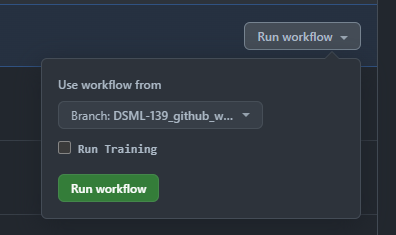

# ncau-mlops-datapl-genai

- [Introduction](#introduction)
  - [Use case](#use-case)
  - [Another sub section](#another-sub-section)
- [MLOps with Vertex AI](#mlops-with-vertex-ai)
  - [Experiment Tracking](#experiment-tracking)
  - [Pipelines](#pipelines)
    - [Components](#components)
    - [Docker](#docker)
  - [Model registry](#model-registry)
  - [Monitoring](#monitoring)
- [CI/CD](#cicd)
  - [Prerequisites](#prerequisites)
  - [Workflows](#workflows)
  - [Compiling, Scheduling and training models via Github Actions](#compiling-scheduling-and-training-models-via-github-actions)
    - [Pipeline definitions](#pipeline-definitions)
    - [Formatting Schedule Cron Strings](#formatting-schedule-cron-strings)
- [Local Development](#local-development)
  - [Environment](#environment)
    - [Via conda](#via-conda)
    - [Via venv](#via-venv)
  - [Adding dependencies](#adding-dependencies)
  - [Notebooks](#notebooks)
  - [Testing](#testing)
  - [Pre-commit hooks](#pre-commit-hooks)
  - [Other useful commands](#other-useful-commands)


----------------------------------
## Introduction

``TODO`` _Add some general info about the project and links to relevant Confluence page(s) here._

## Use case

``TODO`` _Add more details to use case/model being developed here._

## Another sub section
``TODO`` _Add more sub sections if necessary._


# MLOps with Vertex AI

This project leverages GCP's [Vertex AI](https://cloud.google.com/vertex-ai/docs/start/introduction-unified-platform), a fully managed platform for building, deploying and managing machine learning models. MLOps tools used by this repo are
- hosted notebooks with compute of choice (from CPU to GPU) and connection to Big Query without authentication
- experiment tracking for training runs during initial development of models
- pipelines for training, batch inference and monitoring

More infos about the MLOps architecture of this project using Vertex AI is available in the MLF User Guide on [Confluence](https://mantelgroup.atlassian.net/wiki/spaces/EL/pages/4653417293/MLOps+Architecture).

## Experiment Tracking

Experiment tracking is used during the model development phase to compare the effect of different model types, hyperparameters, and features across multiple iterations of a model. A notebook to log experiments to the Vertex Experiments UI is found under `notebooks/experiment_tracking_template.ipynb`. More infos on experiment tracking can be found in the User Guide on [Confluence](https://mantelgroup.atlassian.net/wiki/spaces/EL/pages/4653220666/Experiment+Tracking).

## Pipelines
For this project, pipelines are defined in [vertex_pipelines](vertex_pipelines), using pre-built components from the ``` google_cloud_pipeline_components``` python SDK or custom components invoking custom written code from src sitting in [vertex_components](vertex_components). More info about how to create pipelines in general is is available in the MLF User Guide on [Confluence](https://mantelgroup.atlassian.net/wiki/spaces/EL/pages/4653941240/Vertex+AI+Pipelines).

There are pipelines available for custom python models in the custom folder

Each of them includes a training and inference pipeline. More info on [training pipelines](https://mantelgroup.atlassian.net/wiki/spaces/EL/pages/4653286347/ML+Training+Pipelines) and [inference pipelines](https://mantelgroup.atlassian.net/wiki/spaces/EL/pages/4653384768/Batch+Inference+Pipelines) can also be found in the User Guide.


### Docker

To run the custom training code in [src](src) on Vertex AI, a custom Docker image needs to be built and pushed to the Artifact Registry on GCP. The provided Dockerfile [Dockerfile](Dockerfile) packages the source code (using `poetry build`) and installs the built package into a Docker image. With the CI/CD pipeline inplace the built Docker image gets pushed into the Artifact Registry on GCP to make it available for Vertex AI.

## Model registry

The Vertex Model Registry provides a centralised place to store models. These models can be versioned, deployed, and evaluated to track model evolution throughout its lifecycle. The model registry can be found on the [Vertex UI under the Deploy and Use tab](https://console.cloud.google.com/vertex-ai/models). The models are uploaded to the model registry via the `upload_model` component (found in `upload_deploy.py`) in the case of a custom model. More info about the Vertex AI Model registry can be found [here](https://mantelgroup.atlassian.net/wiki/spaces/EL/pages/4653352034/Vertex+AI+Model+Registry).

To be able to upload a custom model to the Vertex AI model registry, there is a custom container image needed fulfilling certain [requirements](https://cloud.google.com/vertex-ai/docs/predictions/custom-container-requirements#image). These requirements are met creating a custom HTTP server using Flask within [src/inference/app.py](src/xgb_churn_prediction/inference/app.py). The HTTP server is run by using an ENTRYPOINT in the already created [Dockerfile](Dockerfile) via the shell script defined in [entrypoint.sh](src/xgb_churn_prediction/inference/entrypoint.sh). This entrypoint is defined within [upload_deploy.py](vertex_components/model/upload_deploy.py)


## Monitoring
This project has two types of monitoring implemented: prediction drift and performance monitoring. Both of these components write metrics out to BigQuery and [Cloud Monitoring](https://console.cloud.google.com/monitoring/alerting).

The cloud monitoring metrics have policies defined on them (found in `vertex_pipelines/alerting.py`) which trigger slack alerts (channel ml-ops-alerting-env). Adding a `AlertPolicy` to the `POLICIES` list will then configure a new alert to be setup. Make sure to only include alerts for metrics that are being created during training or inference.
```python
POLICIES = [
  AlertPolicy(
        policy_name="Prediction drift",
        metric=f"{policy_prefix}/prediction_drift/drift_detected",
        model_name=f"{MODEL_NAME_PREFIX}_custom_delivery",
  ),
  AlertPolicy(
        AlertPolicy(
        policy_name="Prediction drift",
        metric=f"{policy_prefix}/prediction_drift/drift_detected",
        model_name=f"{MODEL_NAME_PREFIX}_custom_click_collect",
    )
  )
]
```

Thresholds that warrant an alert need to be defined in the `alerts_threshold` dictionary for performance monitoring, which can be found under `src/monitoring/performance_monitoring.py`.

All monitoring components are defined under `vertex_components/monitoring/`. The prediction drift component is incorporated into the inference pipeline while the performance monitoring component has its own pipeline defintion under `vertex_pipelines/monitoring/`.

Find more details for monitoring in the User Guide on [Confluence](https://mantelgroup.atlassian.net/wiki/spaces/EL/pages/4653941228/Model+Monitoring).

# CI/CD

Github Actions are used to implement all CI/CD and are defined in the `.github/`. With each push to a branch, the lint and test workflow will be run. The main and prod branch also trigger their respective workflows.

## Prerequisites
Prior to running CI/CD pipelines, a few prerequisites need to be in place in order to run the pipelines:
1. Creation of the projects in GCP (both nprod and prod)
2. Creation of cloud storage bucket to store the terraform statefile in. Syntax of bucket name: mlops-{project_prefix}-{environment}-{project_name}. So for the nprod environment, the bucket should be named for example 'mlops-{project_prefix}-nprod-{project_name}'
3. Create Service Account (in both nprod and prod project) with the required roles to execute all the steps in the CI/CD pipeline:
    - Editor
    - Storage Admin
    - Storage Object Admin
    - Storage Object Viewer
    - Vertex AI administrator
    - Artifact Registry Administrator
    - Artifact Registry Writer
    - Logs Writer
    - Monitoring Editor
    - BigQuery Data Editor
4. Store the service account key as a secret in Github Secrets with the name SERVICE_ACCOUNT_KEY

## Workflows
There are multiple steps in the NPROD/PROD workflow:
1. Export constant project variables (from `.github/variables/project_vars.env`) to environment variables so that these variables are accessible by all workflow jobs
2. Run terraform code to check if infrastructure is in the desired state and if not, apply required changes to the infrastructure
3. Configure Alerting, Compile and upload workflow & Docker build and push will run in parallel

    a. Compile and upload workflow - compile the pipeline into a json format and upload the compiled json to cloud storage

    b. Docker build and push - Build the image of the src code and push this image to the artifact registry

    c. Configure alerting - setup Cloud Monitoring alert policies
4. Run Training - if run training is selected, fetch the compiled pipeline json file and submit this to Vertex Pipelines to trigger a run

&nbsp;&nbsp;


Find more details for monitoring in the User Guide on [Confluence](https://mantelgroup.atlassian.net/wiki/spaces/EL/pages/4653384775/CI+CD+Process).

## Compiling, Scheduling and training models via Github Actions

### Pipeline definitions
Within the file `vertex_pipelines/pipelines_def.py`, you will find a list of Pipelines that are associated with this project. To define a Pipeline to Compile, Schedule or Train, we must instantiate a `PipelineDefinition`, for example:

```python
PIPELINE_DEFS = [
   PipelineDefinition(
      name="my_inference_pipeline",
      pipeline_function=my_inference_pipeline_function,
      schedule="0 0 * * *",  # every day at midnight
   ),
   PipelineDefinition(
      name="my_training_pipeline",  # a name for the pipeline, can be anything
      pipeline_function=my_training_pipeline_function,
      is_training=True,  # is this a training pipeline?
      # note: there is no schedule for this training pipeline
   ),
]
```

Putting these pipelines into PIPELINE_DEFS will:
* Cause 2 pipeline JSON files to be generated - inference and training - whenever the CI/CD pipeline is run. These will be stored in GCS for later use, either for scheduled or triggered usage purposes. These can be run manually with the command: `python -m vertex_pipelines.compile_pipeline`
* It will schedule `my_inference_pipeline` to be run every day at midnight (or whatever is defined in `schedule`). This schedule will be set up automatically by CI/CD when the relevant environment workflow is run. See the section below, "Formatting Schedule Cron Strings" for more info on schedules.
* It will allow `my_training_pipeline` to be trained in our github actions workflow, because it is marked as `is_training=True`. Running the Github environment workflow will offer the option to train it:


&nbsp;&nbsp;&nbsp;&nbsp;&nbsp;&nbsp;&nbsp;&nbsp;&nbsp;&nbsp;&nbsp;&nbsp;&nbsp;&nbsp;&nbsp;

### Formatting Schedule Cron Strings

The cron string you see in the example - `0 0 * * *` means "every day at midnight". These are in Pacific/Auckland timezone and can be configured to whatever frequency you wish to run.

This guide won't explain cron strings in depth (as plenty of people have written docs on cron strings before), but for more information on how to configure your schedule, please view this section of the GCP docs on [cron job formatting](https://cloud.google.com/scheduler/docs/configuring/cron-job-schedules).

You can also use tools like [crontab.guru](https://crontab.guru/) to help you configure the schedule if you need it.

# Infrastructure

The following infrastructure is setup through terraform:
- If enabling APIs, enabling artifactregistry and aiplatform APIs
- Artifact registry to store docker images in
- Cloud storage bucket to store compiled vertex pipelines in
- Slack Notification Channel in Cloud Monitoring to send alerts to specified slack channel

The infrastructure will be setup for both the nprod and prod environment. The actual creation of the infrastructure for the nprod environment occurs when there is a push to the main branch and for the prod environment when there is a push to the prod branch.

# Local Development

A local development environment can be set-up using [conda](https://docs.conda.io/en/latest/miniconda.html) with the [env.yaml](env.yaml) file or venv with the Python version specified in the [env.yaml](env.yaml) file. This project uses [poetry](https://python-poetry.org/docs/#installation) for dependency management and packaging of source code within [/src](src).

⚠ If you want to change (upgrade/downgrade) the Python version of this project, please make sure to change it in all relevant files:
- [env.yaml](env.yaml) under `dependencies`
- [pyproject.toml](pyproject.toml) under `[tool.poetry.dependencies]`
- [Dockerfile](Dockerfile) base image python version

## Environment
### Via conda
1. Install [conda]()
2. Activate the environment as follows:
    ```bash
    # option1
    conda env create -f env.yaml # if you want the environment to be created in default conda path
    conda activate xgb_churn_prediction

    # option2
    conda env create -f env.yaml -p ./env # if you want the environment to be created in local project directory
    conda activate ./env
    ```
3. Install all dependencies and pre-commit
    ```bash
    poetry install
    pre-commit install
    ```

To create the same environment on Vertex AI workbench, only steps 2. + 3. need to  be executed. Conda is already pre-installed.

4. In order to use the created environment in python notebooks, choose the kernel pointing to the env created in the project in the IDE.
   &nbsp;&nbsp;

   For workbench, in order to use the same conda environment you will need to also run the following command to create the kernel:
   ```bash
   ipython kernel install --user --name=xgb_churn_prediction
   ```
   You will then need to reset/restart the Workbench notebook instance in order to see the newly created local environment to use for the notebook.
   After that, you will see the additional kernel on workbench launcher.
   &nbsp;&nbsp;
5. Add .env file to root of repo like the one below (these env variables will be required compile pipelines or to run tests locally)

⚠ This file should never be committed due to potential credentials being stored in here

  ```bash
  ENVIRONMENT=nprod
  PIPELINE_BUCKET=gs://test-bucket
  MODEL_NAME_PREFIX=xgb_churn_prediction
  ```
  The file is automatically identified as the .env file in VS Code, if not see the VS Code or IDE documentation for more details.

6. Google authentication to access data in Big Query and submit pipelines to Vertex AI via notebook
  ```bash
    gcloud auth login
    gcloud auth application-default login
  ```


### Via venv
If [venv](https://docs.python.org/3/library/venv.html) is preferred to set-up the local environment (not possible on workbench!) follow below steps:

1. Install Python 3.10
2. Activate the environment as follows
    ```bash
    # For Mac / Linux users
    python -m venv venv
    source venv/bin/activate

    # For Windows users
    python -m venv venv
    .\venv\Scripts\activate
    ```

3. Install [poetry](https://python-poetry.org/docs/#installation)
    ```bash
    pip install poetry==1.7.0
    ```
4. Install all dependencies and pre-commit
    ```bash
    poetry install

    # Optional step if this is a new repository not commited to git so far
    git init

    pre-commit install
    ```
5. In order to use the created environment in python notebooks, choose the kernel pointing to the env created in the project in the IDE.
6. Add .env file to root of repo like the one below (these env variables will be required compile pipelines or to run tests locally)

⚠ This file should never be committed due to potential credentials being stored in here

  ```bash
  ENVIRONMENT=nprod
  PIPELINE_BUCKET=gs://test-bucket
  MODEL_NAME_PREFIX=xgb_churn_prediction
  ```
  The file is automatically identified as the .env file in VS Code, if not see the VS Code or IDE documentation for more details.

7. Google authentication to access data in Big Query and submit pipelines to Vertex AI via notebook
  ```bash
    gcloud auth login
    gcloud auth application-default login
  ```

## Adding dependencies

If new (dev) dependencies need to be added to the project, they can either be added manually to the [pyproject.toml](pyproject.toml) file or via the poetry CLI, with the option to specify a version or version constraint; more details see [here](https://python-poetry.org/docs/dependency-specification/).
```bash
    # To add development dependencies (only needed for development process)
    poetry add pytest@latest --group dev

    # To package dependencies
    poetry add pandas@2.0.0
```
Make sure the [poetry.lock](poetry.lock) file is updated with all changes by running
```bash
    poetry lock
```

## Notebooks
All notebooks are going to be placed under the notebooks folder. How the notebooks are structured under the notebooks folder and the naming convention is documented [here]https://mantelgroup.atlassian.net/wiki/spaces/EL/pages/4653940928/Naming+Conventions)
In order to manage dependencies for the notebooks, it is best to setup the environment the same as defined above and use the kernel pointing to the local env. Any new dependencies that are needed for the notebooks can be added to the dev group in poetry.


## Testing

Pytest is used for testing the codebase. Each time a function is added to `src` a corresponding unit test should be created to test the functionality of this new function. There is a github action that will run the testing suite that is triggered by a push.


## Pre-commit hooks

Pre-commit hooks are customizable scripts that can be set up in your GitHub repository to automatically run checks on code changes when trying to commit them via `git commit`. These hooks enable you to enforce coding style conventions, run linters or formatters and validate syntax. To Check the [.pre-commit.yaml](.pre-commit.yaml) file to see which hooks are run is this project. To enable pre-commit hooks make sure to run `pre-commit install` when setting up your dev environment. To run pre-commit hooks on all files without commiting run `pre-commit run --all-files`.


## Other useful commands
Please take a look at the [pyproject.toml](pyproject.toml) under `[tool.poe.tasks]` section for available project commands.

You can run them via `poe <task_name>`, e.g.:
```bash
    poe test
    poe quality
```
